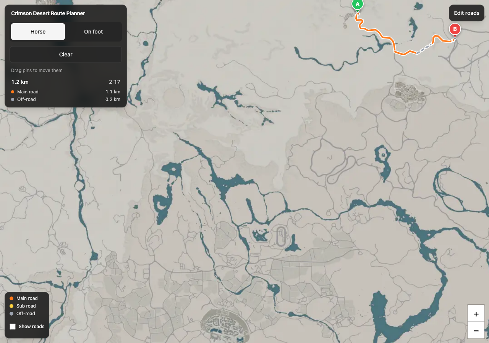
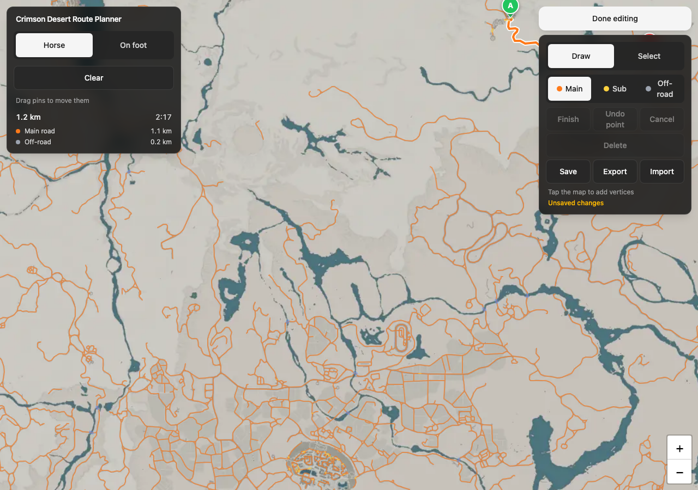

# Crimson Desert Route Planner

A route planner for the game Crimson Desert. Drop pins A and B on the Pywel
world map and get the fastest road route, on horseback or on foot, with main,
sub and off-road classes and an ETA. A built-in editor lets you fix and extend
the traced road graph.



The app is a static Vite site plus one JSON road graph. There is no backend, no
account and no hosted demo: clone it and run it locally.

## Quick start

Needs Node 22 or newer and [uv](https://docs.astral.sh/uv/), which provisions
Python for you (3.11 or newer works). Then:

```bash
npm install
uv venv .venv && uv pip install --python .venv/bin/python pillow numpy scipy scikit-image networkx shapely sknw
.venv/bin/python scripts/fetch-tiles.py
npm run dev
```

Open http://localhost:5173. `scripts/fetch-tiles.py` downloads the map tile
pyramid (5461 WebP tiles, about 24 MB, see `SOURCE.md`) into `data/map/tiles/`
and writes `data/map/manifest.json`; re-running skips tiles that are already
there. Pass `--max-zoom 4` for a quicker, lower-detail download. `data/map/` is
gitignored; `data/roads.json` (the road graph) and `data/water-mask.png` are
committed.

If the tiles are missing, the app tells you to run that script.

## Using the planner

1. Tap the map to place A, then B. A further tap moves B. Drag either pin.
2. **Clear** removes both pins.
3. **Horse** / **On foot** changes speeds (and sometimes the chosen path).
4. Route colours: main roads orange, sub roads yellow, off-road hops dashed grey.
5. **Show roads** draws the whole graph faintly under the route.
6. The summary shows km and an ETA. Speeds and the metres-per-pixel scale are
   assumptions in `src/config/travel.ts`; they have not been calibrated in-game.

The router knows where the water is (`data/water-mask.png`, see D10 in
`docs/DECISIONS.md`). Off-road legs, meaning the pin-to-road hops and the gap
connectors, never cross a river or the sea; only traced roads do, so a crossing
means a bridge or a ford. **Horse** always follows roads and never cuts
cross-country between two roads, while **On foot** may take a direct line if it
stays on land. When no road route exists the summary says "No road route:
straight line shown" and draws the straight line anyway; a pin dropped in water
routes to shore and says "Route crosses water". Without the water mask the
planner still works, it just ignores water.

## Tracing and fixing roads

**Edit roads** (top-right) disables pin placement so you can fix the extracted
graph. **Done editing** returns to the planner.



- **Draw**: tap to add vertices. A tap near a node snaps to it; near an edge
  splits that edge. **Finish** or Enter commits; **Cancel** or Esc discards;
  **Undo point** or Backspace pops the last vertex. Pick Main / Sub / Off-road
  before finishing.
- **Select**: tap an edge, change its class, **Delete** it, or drag its end
  nodes (every connected edge moves with them).
- **Save**: under `npm run dev` the Vite server writes `data/roads.json`. A
  production build downloads the file instead.
- **Export** / **Import** download or replace the graph. Import marks the
  editor dirty.
- Unsaved edits show an **Unsaved changes** marker and warn before closing the
  tab.

## Map pipeline and road extraction

The map is a tile pyramid of 512 px WebP tiles at zoom 0..6, stored as
`data/map/tiles/{z}/{y}/{x}.webp`. Coordinates in `roads.json` are the zoom-4
pixel grid (8192 x 8192); zooms 5 and 6 add real detail on screen. The
manifest's `bounds` is the Pywel window the map fits to (`docs/DECISIONS.md`
D1, D3, D4).

`scripts/extract-roads.py` builds `data/roads.json` from the tiles: it stitches
the Pywel window at zoom 5, masks the grey road ink (which runs straight over
the teal water, so bridges are part of the mask), skeletonizes it, builds a
junction graph, prunes and reconnects it, splits edges where they cross water
and flags those pieces `"bridge": true`, simplifies, and classifies by stroke
width. Key flags:

- `--ridge`: add a ridge-filter pass that picks up the faintest paths (used for
  the committed dataset)
- `--legacy`: import trails from `data/legacy/roads-powerpyx.json` that the
  current map lacks (also used for the committed dataset)
- `--ink-min` / `--ink-max` / `--ink-chroma`: the road-ink colour band
- `--spur-length` / `--component-length`: drop skeleton fragments
- `--junction-snap` / `--bridge-gap`: reconnect stubs and small land gaps
- `--main-radius`: roads (wide, `main`) vs paths (narrow, `sub`)
- `--bounds` / `--zoom`: window and resolution

It also writes `data/map/roads-debug.png` (mask + graph over the map) and
`data/water-mask.png`, an 8-bit greyscale PNG of the whole map at half
resolution (255 = water, 0 = land). Gaps that remain are bridged by the
router's off-road connectors (up to 200 px, `CONNECTOR_RADIUS_PX` in
`src/config/travel.ts`) on land only; trace the rest in the editor. Extraction
never emits the `offroad` class.

`scripts/review-tiles.py` renders labelled review tiles (graph over the map,
dead ends ringed, water outlined) into `data/map/review/` for a visual sweep;
`--compare other.json` overlays a second graph in magenta.

## Build and test

```bash
npm run typecheck
npm run lint
npm test
npm run build      # static dist/ including dist/data/ (tiles, roads.json, water-mask.png)
```

End-to-end smoke test. It needs Playwright and its Chromium in `.venv` (not
part of the quick start) plus the dev server on port 5173, and it restores
`data/roads.json` afterwards:

```bash
uv pip install --python .venv/bin/python playwright && .venv/bin/python -m playwright install chromium
npm run dev -- --port 5173 --strictPort   # in another terminal
.venv/bin/python tests/e2e/smoke.py
```

## Map data and licensing

- **Code** in this repository is released under the [MIT License](LICENSE).
  The data files described below are the exception: they are covered by this
  section, not by the MIT grant.
- **Map tiles** are third-party content from The Hidden Gaming Lair's Crimson
  Desert map (https://crimsondesert.th.gl), a fan site with no stated reuse
  licence. `scripts/fetch-tiles.py` downloads them to your machine; they are
  never committed or redistributed by this project, and no licence to them is
  granted here. See `SOURCE.md` for the exact URL and fetch details.
- **The committed road graph and water mask** (`data/roads.json`,
  `data/water-mask.png`, `data/legacy/roads-powerpyx.json`) are derived from
  fan-hosted renders of the in-game map. They are provided for personal use
  with no claim over the underlying map. The retired PowerPyx source they
  partly come from stays credited in `SOURCE.md`.
- Crimson Desert is a trademark of Pearl Abyss. This project is not affiliated
  with or endorsed by Pearl Abyss.

## Contributing

Issues and pull requests are welcome. Before opening a PR run
`npm run typecheck`, `npm run lint` and `npm test`, plus `npm run build` if you
touched `vite.config.ts` or anything under `data/`. Keep commits atomic with
imperative subjects, and use kebab-case for files and branches. Design
decisions live in `docs/DECISIONS.md`; change the decision there first, then
the code. Open questions and follow-ups are in `docs/NOTES.md`.

## Layout

```
src/
  components/   MapView, ControlPanel, EditorPanel, Legend, RouteSummary
  editor/       graph-edit + Leaflet draw/select overlay
  routing/      A* over the road graph, water mask
  lib/          CRS, roads + water-mask load/save, pin icons
  config/       travel.ts (speeds and colours)
scripts/        fetch-tiles.py, extract-roads.py, review-tiles.py, tiles.py
data/           roads.json + water-mask.png (committed); legacy/; map/ (gitignored)
docs/           DECISIONS.md, NOTES.md, screenshots/, build-time working docs
tests/          unit/ (roads.json + water-mask checks), e2e/smoke.py (Playwright)
```
